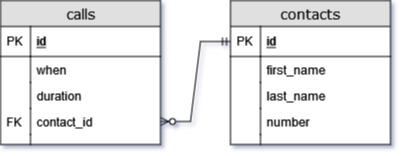

1. Write a SQL statement to add the following call data to the database:

| when | duration | first_name | last_name | number |
|:---:|:---:|:---:|:---:|:---:|
| 2016-01-18 14:47:00 | 632 | William | Swift | 7204890809 |

<br>
<br>
<br>

```sql
INSERT INTO calls
       ("when", duration, contact_id)
VALUES ('2016-01-18 14:47:00', 632, 6);
```
---

2. Write a SQL statement to retrieve the call times, duration, and first name for all calls not made to William Swift.

<br>
<br>
<br>

```sql
SELECT calls.when, calls.duration, contacts.first_name
  FROM calls
 INNER JOIN contacts
    ON contacts.id = calls.contact_id
 WHERE contacts.id != 6; -- We could also concatenate the name and check it with 'William Swift', but id was faster to type
```
---

3. Write SQL statements to add the following call data to the database:

| when | duration | first_name | last_name | number |
|:---:|:---:|:---:|:---:|:---:|
| 2016-01-17 11:52:00 | 175 | Merve | Elk | 6343511126 |
| 2016-01-18 21:22:00 | 79 | Sawa | Fyodorov | 6125594874 |

<br>
<br>
<br>

```sql
INSERT INTO contacts
       (first_name, last_name, number)
VALUES ('Merve', 'Elk', 6343511126),
       ('Sawa', 'Fyodorov', 6125594874);

INSERT INTO calls
       ("when", duration, contact_id)
VALUES ('2016-01-17 11:52:00', 175, 26),
       ('2016-01-18 21:22:00', 79, 27);
```
---

4. Add a constraint to `contacts` that prevents a duplicate value being added in the column `number`.

<br>
<br>
<br>

```sql
ALTER TABLE contacts
  ADD UNIQUE (number);
```
---

5. Write a SQL statement that attempts to insert a duplicate number for a new contact but fails. What error is shown?

<br>
<br>
<br>

```sql
INSERT INTO contacts
       (first_name, last_name, number)
VALUES ('Scam', 'Call', 6125594874);

/*
ERROR:  duplicate key value violates unique constraint "contacts_number_key"
DETAIL:  Key (number)=(6125594874) already exists.
*/
```
---

6. Why does "when" need to be quoted in many of the queries in this lesson?

<br>
<br>
<br>

This is because `WHEN` is a SQL keyword and is a reserved word. By putting it in quotes, we are telling SQL it is an object of some kind.

---

7. Draw an entity-relationship diagram for the data we've been working with in this assignment.

<br>
<br>
<br>


